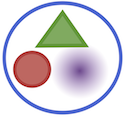

# Lujia-Light

A Julia library for numerical analysis experiments with
multi-scale algorithms for materials science. The package
implements some basic interatomic potentials
and a minimalistic electronic structure model (tight-binding).
It is *not* designed for materials science applications,
but purely for experimentation with new multi-scale algorithms.

For serious molecular simulation see
[Atoms.jl](https://github.com/libAtoms/Atoms.jl), but note that
this is also still under heavy development.

**Warning:** as of 1 June 2017, this is under heavy development. At the
moment, the following notebooks can be followed to look at some
completed parts of the library:

* `FEM`: brief intro how to use the `LujiaLt.FEM` module
* `Introduction to Approximation`: implementation of some elementary toy problems

## Installation

In the Julia REPL:
```jl
Pkg.add("PyCall")
Pkg.add("Compose")
Pkg.add("PGFPlots")
Pkg.clone("https://github.com/cortner/LujiaLt.git")
```

<!-- ## Examples

For now, please see the `IJulia` notebooks in the
`./notebooks` folder. -->
